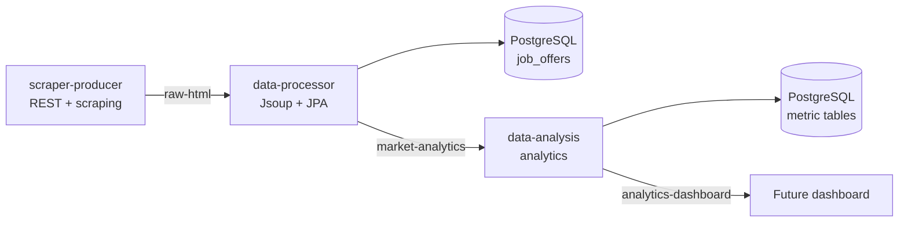

# Distributed Web Scraper Kafka

A distributed platform for capturing HTML from web sources, extracting job-offer information, and calculating labor-market metrics through Kafka events.

The project follows an Event-Driven Architecture (EDA): each microservice has a focused responsibility and communicates through Kafka topics rather than direct service-to-service calls.

## Arquitectura



The dashboard and the fourth microservice are not part of this repository yet.

## Microservices

### `scraper-producer`

Exposes `POST /api/v1/scrape`, downloads a URL, removes unwanted HTML elements with Jsoup, and publishes the cleaned HTML to `raw-html`.

- Uses Redis with the Cache-Aside pattern and a one-hour TTL.
- Uses the URL as the Kafka key.
- Protects the HTTP request with a Resilience4j Circuit Breaker.
- Uses Spring Boot, Spring Kafka, Spring Data Redis, and Jsoup.

When the URL is cached, the service returns the stored HTML and does not publish another event.

### `data-processor`

Consumes `raw-html` as `ConsumerRecord<String, String>` to preserve the URL from the Kafka key.

- Parses HTML with Jsoup.
- Extracts the title, company, salary, technologies, location, and extraction date.
- Normalizes technologies and salary ranges when available.
- Generates a SHA-256 `dedupe_key`.
- Persists the offer in the `job_offers` table.
- Publishes a compact JSON event to `market-analytics`.
- Waits for Kafka confirmation within the persistence transaction.

### `data-analysis`

Consumes `market-analytics` and maintains its own metrics in PostgreSQL.

- Calculates daily, weekly, and monthly metrics.
- Calculates average salary by technology.
- Produces a top-five ranking of the highest-paid technologies.
- Calculates technology demand.
- Classifies offers as `BACKEND`, `FRONTEND`, or `OTHER`.
- Ignores duplicate events using `jobId`.
- Publishes complete snapshots to `analytics-dashboard`.

It does not expose a REST endpoint or implement the dashboard.

## Technologies

| Technology | Use |
|---|---|
| Java 17 | Primary language |
| Spring Boot 4.1.0 | Microservice applications and configuration |
| Spring Kafka | Kafka producers and consumers |
| Apache Kafka 3.7.0 | Event backbone |
| PostgreSQL 16 | Relational persistence |
| Spring Data JPA / Hibernate | Object-relational mapping and data access |
| Redis 7 | Scraper cache |
| Jsoup 1.17.2 | HTML parsing and cleanup |
| Resilience4j 2.2.0 | Producer Circuit Breaker |
| Docker Compose | Infrastructure and local execution |
| Jackson | JSON event serialization |

## Data flow

1. The client sends a URL to `scraper-producer`.
2. The producer checks Redis for the URL.
3. If there is no cache entry, it downloads and cleans the HTML.
4. It publishes the URL as the key and the HTML as the value in `raw-html`.
5. `data-processor` consumes the event and extracts the offer.
6. It generates the `dedupe_key` and stores the offer in `job_offers`.
7. It publishes the normalized offer to `market-analytics`.
8. `data-analysis` updates demand, salary, and profile metrics.
9. It persists metrics for each time period.
10. It publishes a self-contained snapshot to `analytics-dashboard`.

## Topics Kafka

| Topic | Producer | Consumer | Content |
|---|---|---|---|
| `raw-html` | `scraper-producer` | `data-processor` | URL key and cleaned HTML value |
| `market-analytics` | `data-processor` | `data-analysis` | Normalized offer as JSON |
| `analytics-dashboard` | `data-analysis` | Future dashboard | JSON metrics snapshot |

The URL is used as the key in `raw-html` and as the normalized event key when available. Kafka preserves ordering within a partition. The processor uses `dedupe_key`; analysis uses `jobId` and the `processed_analytics_events` table.

## Persistence

The services use the same PostgreSQL instance from Compose, but keep separate tables by responsibility:

| Table | Service | Purpose |
|---|---|---|
| `job_offers` | `data-processor` | Extracted and normalized offers |
| `technology_metrics` | `data-analysis` | Technology demand, salary sums, counts, and averages |
| `profile_metrics` | `data-analysis` | Backend, Frontend, and Other counts |
| `processed_analytics_events` | `data-analysis` | Idempotency by `jobId` |

## Resilience and idempotency

- **Cache-Aside:** Redis avoids downloading the same URL again for one hour.
- **Circuit Breaker:** the producer returns a fallback response when the external source fails repeatedly.
- **Kafka retries:** processor and analysis retry twice with a one-second delay, then recover the record so one partition is not blocked indefinitely.
- **Processor deduplication:** a URL produces a stable identity; without a URL, offer fields are combined and hashed with SHA-256.
- **Processor transaction:** publication of `market-analytics` waits for confirmation. If it fails, the exception allows the input record to be retried.
- **Analysis idempotency:** if `jobId` is already in `processed_analytics_events`, the event does not increment metrics again.

## Running with Docker

### Requirements

- Docker Engine.
- Docker Compose plugin.
- Java 17 and Maven 3.9+ if builds will be run outside Docker.

### Start the stack

From the repository root:

```bash
docker compose up -d --build
docker compose ps
```

Exposed services:

| Service | Port |
|---|---:|
| `scraper-producer` | `8080` |
| `data-processor` | `8081` |
| `data-analysis` | `8082` |
| Kafka | `9092` |
| PostgreSQL | `5433` |
| Redis | `6379` |

Inside Docker, applications use `kafka:9094`, `postgres:5432`, and `redis:6379`. From the local machine, properties use `localhost` and the published ports.

### Test the producer

```bash
curl -X POST http://localhost:8080/api/v1/scrape \
	-H 'Content-Type: application/json' \
	-d '{"url":"https://www.arbeitnow.com/jobs/companies/mayflower-gmbh/software-entwicklerin-mit-schwerpunkt-genai-wurzburg-80985"}'
```

Use a new URL to force a download. If the URL exists in Redis, the producer responds from cache and does not generate another Kafka event.

### Check services and topics

```bash
docker compose ps
docker exec scraper-kafka /opt/kafka/bin/kafka-topics.sh \
	--bootstrap-server localhost:9092 --list
docker exec scraper-postgres psql -U univalle_user -d market_db -c '\dt'
```

### Stop the stack

```bash
docker compose down
```

The `postgres-data` volume is kept until `docker compose down -v` is explicitly run.

## Tests and validation

Run the tests from each module:

```bash
cd javaproducer && ./mvnw test
cd ../dataprocessor && mvn clean test
cd ../data-analysis && mvn clean test
```

The current tests cover:

- producer: Spring context loading;
- processor: parsing, missing fields, normalization, salary ranges, and publication failure handling;
- analysis: profile classification, aggregation, idempotency, and compatibility with historical events.

The end-to-end flow was also validated with a real Arbeitnow job source. The offer reached PostgreSQL, produced `market-analytics`, updated the metrics, and generated an `analytics-dashboard` snapshot. The same event was replayed and ignored by `jobId` without duplicating counts.

## Project structure

```text
.
├── javaproducer/
│   ├── pom.xml
│   └── src/
├── dataprocessor/
│   ├── pom.xml
│   └── src/
├── data-analysis/
│   ├── pom.xml
│   └── src/
├── Docs/
├── docker-compose.yml
└── README.md
```

## Technical decisions

- **Event-Driven Architecture:** Kafka decouples capture, processing, and analytics.
- **Single responsibility:** each service transforms one data shape and publishes the next contract.
- **Domain-separated persistence:** processor and analysis share a PostgreSQL instance, but not JPA entities or internal tables.
- **Processing before analytics:** `data-processor` converts unstructured HTML into a small, stable event.
- **Explicit idempotency:** Kafka redeliveries must not create repeated offers or metrics.
- **Controlled complexity:** the project uses JPA, simple database aggregations, and deterministic rules; it does not introduce Spark, Kafka Streams, or ML.

## Current scope

Implemented:

- `scraper-producer`;
- `data-processor`;
- `data-analysis`;
- prepared `analytics-dashboard` topic.

Intentionally pending:

- final consumer and dashboard.